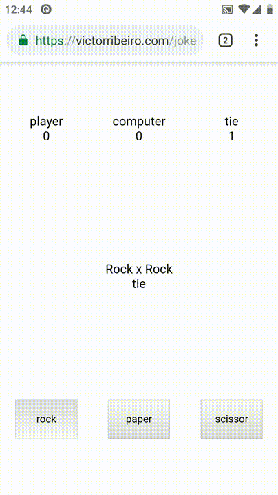

# JoKenPo

Can a [Neural Network](https://github.com/victorqribeiro/MLP) predict your next move on a game of [rock, paper, scissors](https://en.wikipedia.org/wiki/Rock%E2%80%93paper%E2%80%93scissors)?

Play it [here](https://victorribeiro.com/jokenpo)

Alternative link [here](https://victorqribeiro.github.io/jokenpo/index.html)

## About

An experiment involving a game of rock, paper and scissor, also known as Jo Ken Po. During the first 3 rounds the computer chooses a move (rock, paper or scissor) at random. After that, it assumes it has enough data about the player to predict it's pattern. The data set consists of the player last two moves, being the last one, the one they'll do after the first one. Kind of confusing, right?! Simple put, the computer stores the first move as a input *x* and the move after that as a label or target *y*, meaning that after the player choosing rock, for instance, there's a possibility they'll choose paper as the next move. If the computer predicts the player will play rock, it plays paper, so on and so forth. Every time the computer loses, it trains the neural network again.

## Know problems 

This is just an experiment, don't be upset if the computer (my neural network) won't do a good job of playing against you. Also, I'm never deleting from the data set, meaning that eventually the time to train the neural network will be larger and larger.
